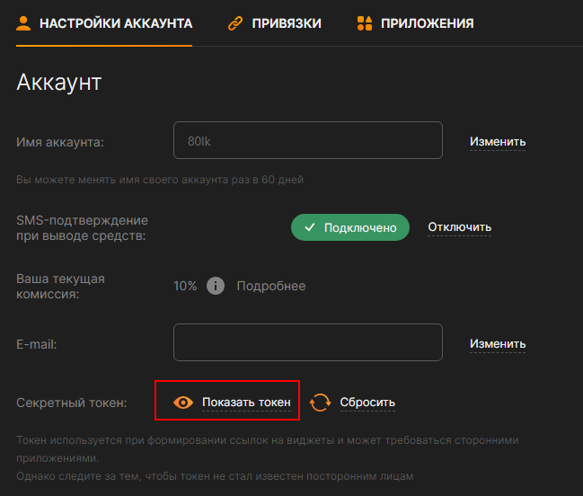
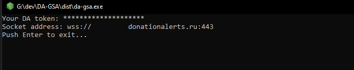

# SAMMI DA Triggers

SAMMI-Расширение, добавляющий тригер донатов из DonationAlerts

## Не приходят уведомления

Если вам не приходят уведомления от DA, существует 2 причины:
1. Указан не верный токен, проверьте его
2. Вам, по какой-то причине, не подходит хост сокета. Решение проблемы, указать в настройках что вам не приходят уведомления, и указать свой хост.

## Как узнать свой хост сокета

### DA-GSA

1. Скачайте [DA-GSA](https://github.com/80LK/DA-GSA/releases/download/1.0/da-gsa.exe)
2. Перейдите в [настройки профиля](https://www.donationalerts.com/dashboard/general-settings/account) и скопируйте секретный токен.

3. Запустите DA-GSA и вставтье туда свой токен. Нажмите `Enter`.

[GitHub DA-GAS](https://github.com/80LK/DA-GSA)

### Альтернативный вариант

1. Запустите любую группу [виджетов](https://www.donationalerts.com/dashboard/widgets/alerts).

2. В открывшемся окне запустите DevTools(F12, Ctrl+Shift+I или ПКМ -> "Посмотреть код")

3. Откройте вкладку Network и выберите "WS"

4. Нажмите F5 и найдите сокет DonationAlerts (Request URL содержит donationalerts.ru). Хост сокета указал в группе "Request Heaeders" в поле "Host".

## Используется
* [Курсы валют, API](https://www.cbr-xml-daily.ru)
